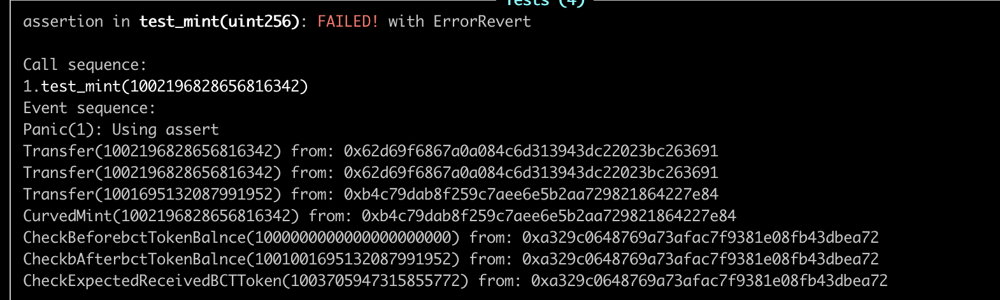
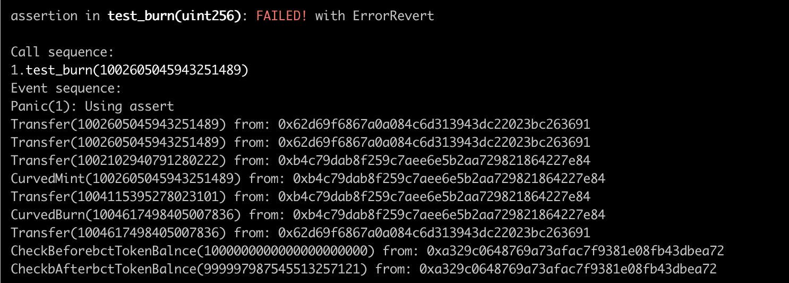

## Use Echidna to test the bonding curve

### the invariants
1. the amount of mint token should euqal afterbctTokenBalnce - beforebctTokenBalnce  while minting
2. the amount of burn token shuuld euqal the corresponding minted token while burning

### question

1. The results for  the invariants almost equal, but exist some small gaps as below. so I guess its the precision problem. Now can't sure TODO

